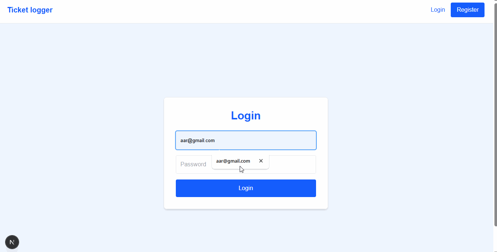

# 🚀 Ticket Logger

> Ticket logging web app built with next.js and postgres.

[](LICENSE)
[]()

---

## 📸 Demo / Screenshots

<p align="center">
  
</p>

---

## 📜 About

Basic Support Ticket Logging App Built with Nextjs. The project was used for exploring Sentry io.

---

## ✨ Features

- ✅ Log in log out user
- ✅ Log a ticket
- ✅ View Tickets
- ✅ Close Tickets

---

## 🛠 Tech Stack

**Frontend:** Next.js, TailwindCSS, cookie, jose  
**Backend:** Next.js, prisma, neon, sentry,
**Database:** Postgres

---

## ⚙️ Installation

```bash
# Create a .env file
SENTRY_AUTH_TOKEN=" <sentry auth token>"
DATABASE_URL= "<postgres database url> "
AUTH_SECRET = "<Any generated Secret>"

# Clone the repo
git clone https://github.com/Daneelv/ticket-logger.git

# Install dependencies
npm install

# Run locally
npm run dev
```
